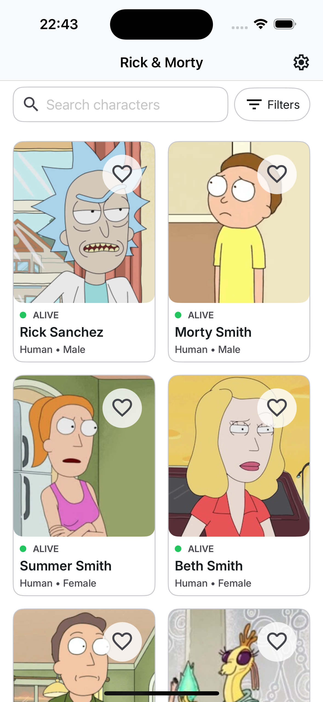
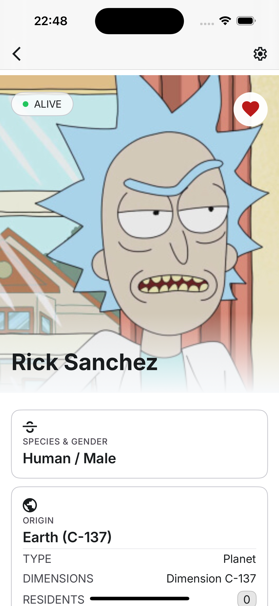
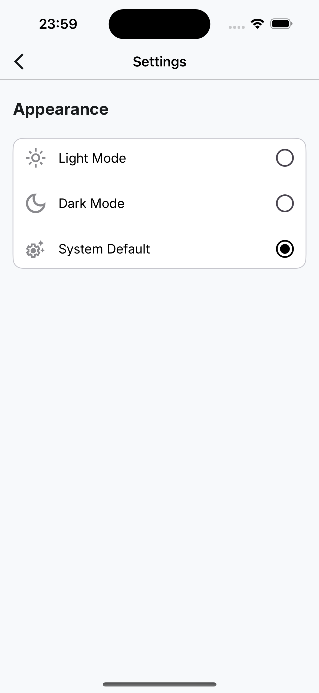
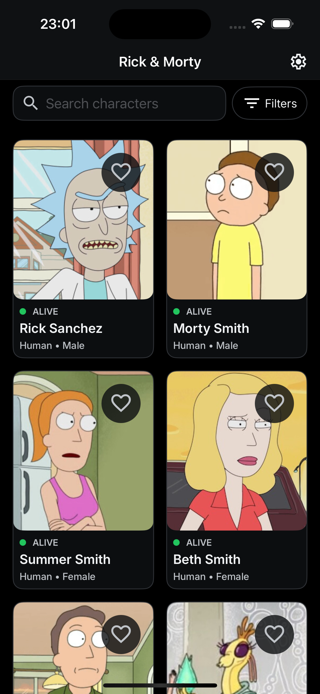
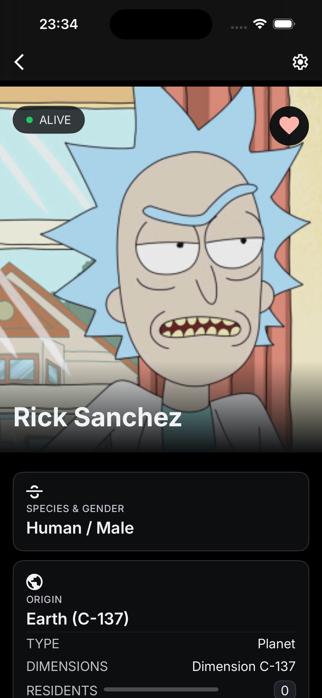
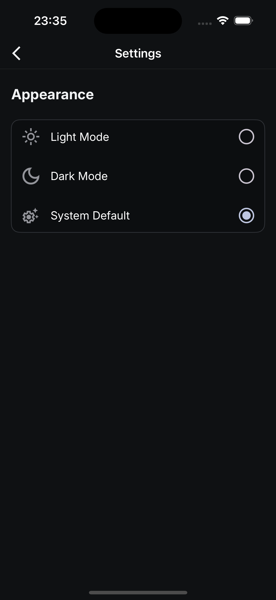

# Rick and Morty Sample App (iOS)

**Rick and Morty Sample App**

Sample master/detail iOS application that consumes the [Rick and Morty API](https://rickandmortyapi.com/) to display a paginated list of characters and a detailed character profile. It is the iOS counterpart of the Android sample in the `RickAndMortyAppSample` repository, replicating its UI and behaviour.

The application has been built with Clean Architecture principles, the Repository pattern and MVVM, with a clear separation between presentation, domain, data and framework concerns. The UI is implemented entirely with SwiftUI and dependency injection is handled with the third-party [Factory](https://github.com/hmlongco/Factory) library, which provides a container-based DI with the `@Injected` property wrapper and `ParameterFactory`.

## Features

- Browse Rick and Morty characters in a paginated grid.
- Cache the main character list locally with SwiftData.
- Search characters by name.
- Filter characters by species, gender and status.
- Pull to refresh the character list.
- Open a character detail screen with image, status, species, gender, origin, last known location and episode appearances.
- Load additional location and episode information for character details.
- Mark and unmark characters as favourites with local persistence.
- Choose light, dark or system theme from the settings screen.
- Handle loading, empty, connectivity, server and unknown error states.
- Support offline-first character details when cached data is available.

## Architecture

The project follows a layered Clean Architecture approach. The domain layer contains business rules and repository contracts, the data layer coordinates data sources and pagination, the framework layer integrates external technologies such as `URLSession` and SwiftData, and the presentation layer exposes the application features through SwiftUI screens and `@Observable` ViewModels.

The project is organized into the following layers:

- **Presentation:** SwiftUI screens, UI state models, ViewModels and navigation.
- **Domain:** Business models, repository contracts, use cases and application errors.
- **Data:** Repository implementations, data source contracts and data mappers.
- **Framework:** Network services, the `APIClient`, SwiftData models and persistence.
- **Di:** Factory dependency-injection registration modules extended on the shared `Container`.

The main flow is:

```text
SwiftUI View -> ViewModel -> Use Case -> Repository -> Data Source
                                                  -> URLSession / SwiftData
```

The home screen reads the character list from SwiftData when the cache is fresh. The repository coordinates pagination manually and synchronizes remote pages with the local database. Search and filters call the API directly. Character details first expose cached data when available and then refresh from the API.

## Cache Strategy

The main character list uses SwiftData as its local source of truth.

Cached character data is considered fresh for **one hour**. During this period:

- The application displays the cached list without requesting the first page again.
- Pull-to-refresh reuses the cache while it is still fresh.
- Pagination can continue using the stored remote key and next page.
- Once the TTL expires, the next refresh requests the first pages from the API and replaces the cached list.

On a cache miss the repository prefetches the first pages from the API synchronously and stores them locally. The cache timestamp and the next page are stored with the paging key (`PagingKeyData`) and are updated when the first page is successfully synchronized. Character details also use cached data when available. Additional location and episode information is cached independently after being loaded successfully.

Searches and filters call the API directly, so they request data from the API and do not use the main character list TTL.

Character images use Kingfisher's shared `ImageCache` with a 50 MB disk cache and a memory cache limited to 25% of the available memory. The cache is configured once at application startup.

## Navigation Flow

```text
Home -> Character Detail -> Settings
```

The Home screen opens a character detail route using the character ID. Both Home and Detail can open Settings, and each secondary screen can navigate back to the previous destination.

## Error Handling

The domain layer represents connectivity, server and unknown failures through `AppError`. Detail screens map these errors to user-facing messages while preserving cached character content when possible.

Paging errors on the Home screen are currently presented through a generic connectivity message. This keeps the list experience simple, but does not expose the original server error code to the user.

## Known Limitations

- Pull-to-refresh does not force a network request while the main character cache is still valid.
- Name searches are activated after entering at least three characters.
- Searches and filters use the remote API and require network connectivity.
- Location and episode details are available offline only after they have been cached.
- The Home screen uses a generic connectivity message for paging errors.

## Configuration and Security

The API base URL is provided through `NetworkConstants.baseURL` and defaults to:

```text
https://rickandmortyapi.com/api
```

The application does not require API keys or other secrets. The selected theme mode is persisted locally in `UserDefaults` through the settings data source and propagated to the whole app with a theme change notification.

## Screens

- **Home:** Character grid, search bar, filters, favourites and pull-to-refresh.
- **Detail:** Character header, status, favourite action, information cards, locations and episodes.
- **Settings:** Application appearance and theme selection.

## Screenshots

### Light Mode

| Home | Character Detail | Settings |
| :---: | :---: | :---: |
|  |  |  |

### Dark Mode

The application supports light, dark and system themes from the settings screen. Dark mode applies the same palette across all screens.

| Home | Character Detail | Settings |
| :---: | :---: | :---: |
|  |  |  |

## Libraries Used

- **Swift / SwiftUI:** Main programming language and declarative UI toolkit.
- **SwiftUI NavigationStack:** Type-safe navigation between application destinations.
- **`@Observable` ViewModels:** Lifecycle-aware state management.
- **Swift Concurrency:** Asynchronous and non-blocking application work.
- **Factory:** Third-party dependency injection library (container-based, used with `@Injected` and `ParameterFactory`).
- **SwiftData:** Local SQLite abstraction used for character, location, episode and paging-key caching.
- **`UserDefaults`:** Persistence for the selected theme mode.
- **`URLSession` and `Codable`:** Type-safe HTTP client and JSON serialization (with a 30 second request and resource timeout).
- **Kingfisher:** Third-party image loading and caching library (disk and memory cache).
- **`os.Logger`:** System logging for the network and database layers
- **XCTest:** Unit and UI test framework.
- **Mocking with protocols and fakes:** Lightweight test doubles for use cases and repositories.

## Testing

The project includes a unit test target (`rickyandmortyTests`, 80 tests) and a SwiftUI UI test target (`rickyandmortyUITests`, 16 tests).

### Unit tests

Unit tests cover the presentation, domain, data and framework layers:

- **Presentation (ViewModels and mappers):** `HomeViewModelTests`, `DetailViewModelTests`, `SettingsViewModelTests` and display-model mapper tests. ViewModels are exercised with fake repositories and mocked use cases, covering happy paths, loading and error states, favourites, search and filter debouncing, and the cancellation/coalescing of in-flight reloads.
- **Domain (use cases):** `GetFilterGroupsUseCaseTests` and contract coverage through fakes.
- **Data and framework (mappers):** `CharacterDtoMapperTests`, `EpisodeDtoMapperTests`, `LocationDtoMapperTests`, `CharacterDataMapperTests`, `EpisodeDataMapperTests`, `LocationDataMapperTests` and `ThemeModeDisplayModelMapperTests`.
- **Builders and fixtures:** test builders for domain, data and DTO models, and `MockUIFixtures` + `MockURLProtocol` for stubbed network responses.

### UI tests

SwiftUI UI tests cover the end-to-end navigation and behaviour of the three main screens:

- **Home:** character grid rendering, search results, favourites and pull-to-refresh.
- **Detail:** character information display, favourite toggling, episodes section and back navigation.
- **Settings:** light, dark and system theme selection and back navigation.

UI tests run with the `--ui-testing` launch argument, which clears the `UserDefaults` domain, installs `MockUIFixtures` and routes the network layer through `MockURLProtocol` for deterministic responses.

### How to run the tests

From the command line:

```bash
xcodebuild -project rickyandmorty.xcodeproj -scheme rickyandmorty \
  -destination 'platform=iOS Simulator,name=iPhone 16' test
```

To run only a specific suite:

```bash
xcodebuild -scheme rickyandmorty -destination 'platform=iOS Simulator,name=iPhone 16' \
  test -only-testing:rickyandmortyTests
```

In Xcode, open the project, select the `rickyandmorty` scheme and press `Cmd + U`.

## Requirements

- Xcode 16 with iOS deployment target 17.0 or higher.
- An iOS Simulator or a physical device running iOS 17.0 or higher.

## Build and Run

Open `rickyandmorty.xcodeproj` in Xcode and run the `rickyandmorty` scheme on a simulator or connected device.

From the command line, use:

```bash
xcodebuild -project rickyandmorty.xcodeproj -scheme rickyandmorty \
  -destination 'platform=iOS Simulator,name=iPhone 16' build
```

## Code Style

The project uses **SwiftLint** as its linting tool, equivalent to the Android sample's ktlint. It is configured through a `.swiftlint.yml` file at the repository root and runs automatically as a build phase (with `ENABLE_USER_SCRIPT_SANDBOXING` disabled so the script can read the source files).

Install SwiftLint with Homebrew (rerun the build afterwards so the `SwiftLint` build phase picks it up):

```bash
brew install swiftlint
```

If SwiftLint is not installed, the build phase logs a warning and skips linting without failing the build.

The repository includes a Git pre-commit hook (`.githooks/pre-commit`) that runs `swiftlint lint --strict` and aborts the commit if it fails. Enable it with:

```bash
git config core.hooksPath .githooks
```

## Continuous Integration (CI)

The repository includes a GitHub Actions workflow (`.github/workflows/ci.yml`) that runs on every push to `master` and on every pull request targeting `master`. It can also be triggered manually from the Actions tab (`workflow_dispatch`).

The workflow runs the following jobs in parallel:

- **Unit tests:** runs `xcodebuild test` with `-only-testing:rickyandmortyTests` and uploads the `.xcresult` bundle as an artifact.
- **Build:** builds the debug app (`xcodebuild build`) and uploads the zipped `.app` as an artifact.
- **Static analysis:** runs `swiftlint lint --strict` to enforce the project code style.
- **UI tests:** runs `xcodebuild test` with `-only-testing:rickyandmortyUITests` on an iOS Simulator (iPhone 16) and uploads the `.xcresult` bundle as an artifact.

A push while a run is in progress cancels the previous run (`concurrency` with `cancel-in-progress`). The workflow uses `macos-15` runners with Xcode 16.2.

## Project Structure

```text
rickyandmorty/
├── Data/
│   ├── DataConstants.swift
│   ├── DataSource/                Data source contracts (RemoteDataSource, LocalDataSource, SettingsPreferenceDataSource)
│   ├── Mapper/                    Data-to-domain mappers
│   └── Repository/                Repository implementations
│
├── Di/                            Factory registration modules (Container extensions) and the AppContainer bootstrap
│
├── Domain/
│   ├── Exception/                 AppError and application errors
│   ├── Model/                     Business models
│   ├── Repository/                Repository contracts
│   ├── FilterConstants.swift
│   └── UseCase/                   Application business use cases
│
├── Framework/
│   ├── Core/                      Fonts, logging and shared core utilities
│   ├── Database/
│   │   ├── DataStore.swift        SwiftData ModelContainer factory
│   │   ├── DatabaseConstants.swift
│   │   ├── Model/                 SwiftData models (CharacterData, LocationData, EpisodeData, PagingKeyData)
│   │   └── Repository/            SwiftData local data source and contract
│   ├── Extensions/                Shared extensions (Error+AppError, UserDefaults, ...)
│   ├── Network/
│   │   ├── APIClient.swift        URLSession-based async HTTP client
│   │   ├── ImageCacheConfig.swift Kingfisher configuration
│   │   ├── NetworkConstants.swift
│   │   ├── NetworkError.swift
│   │   ├── DataSource/            RemoteDataSource implementation
│   │   ├── Dto/                   API response models
│   │   └── Service/               API services and endpoints
│   ├── Settings/DataSource/       UserDefaults-backed settings data source
│   └── Testing/                   MockURLProtocol and UI test fixtures
│
├── Presentation/
│   ├── Core/                      Shared UI components, display-model mappers and constants
│   ├── Detail/                    Character detail screen, components and ViewModel
│   ├── Filter/                    Filter bottom sheet, components and models
│   ├── Home/                      Character list, search, filters, components and models
│   ├── Navigation/                Navigation routes and root container
│   ├── Settings/                  Theme settings screen, components, models and ViewModel
│   └── Ui/Theme/                  SwiftUI theme, colors and typography
│
├── Resources/                     App resources and fonts
├── Assets.xcassets/               App icons and image assets
├── rickyandmortyApp.swift         App entry point, SwiftData container and DI bootstrap
└── PreviewContainer.swift         SwiftData container for SwiftUI previews
```

## API

Character, location and episode data are provided by the [Rick and Morty API](https://rickandmortyapi.com/). This project is a sample application created for demonstration and technical evaluation purposes.
